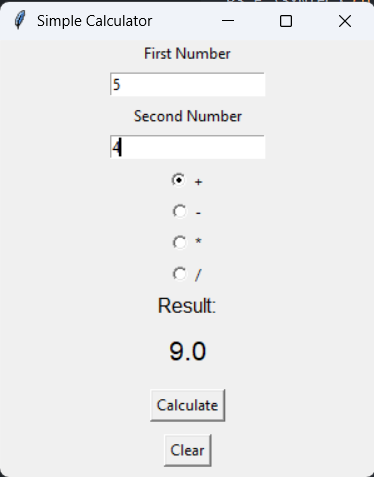

# Syntecxhub_Simple_Calculator
A Python-based calculator supporting CLI and GUI with modular design and input validation.
# Simple Calculator (CLI + GUI)

A Python-based calculator project that supports both command-line interaction and a graphical user interface.

## Features
- Basic operations: Addition, Subtraction, Multiplication, Division
- Input validation and divide-by-zero handling
- Modular design (separate logic functions)
- CLI-based calculator (menu driven)
- GUI-based calculator using Tkinter

## Tech Stack
- Python
- Tkinter (for GUI)

## Project Structure
calculator_logic.py   # Core functions
cli_calculator.py     # Command-line version
gui_calculator.py     # GUI version
## 📸 Preview

